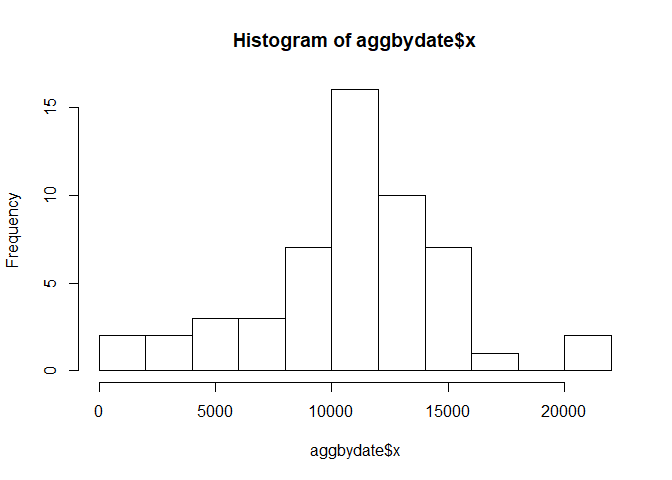
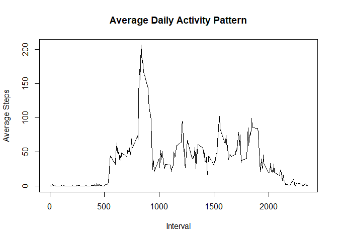
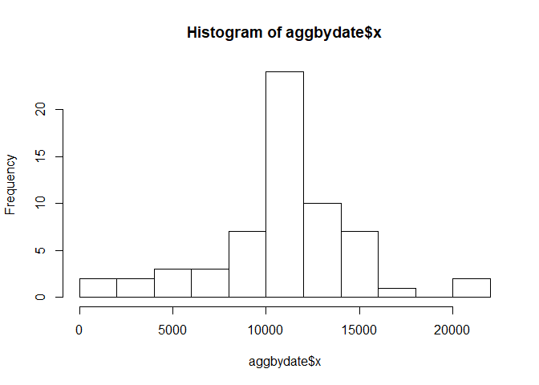
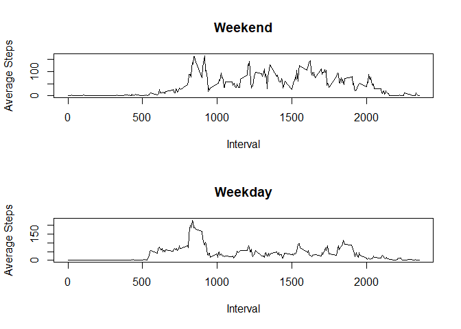

## Loading and preprocessing the data

Load data from .csv file provided:


```r
rawdata <- read.csv("activity.csv", sep=",", header=TRUE, na.strings = c("NA","",'#DIV/0!'))
```

Remove NA values

```r
dataset <- rawdata[!is.na(rawdata$steps),]
```

Review the data

```r
head(dataset,10)
```

```
##     steps       date interval
## 289     0 2012-10-02        0
## 290     0 2012-10-02        5
## 291     0 2012-10-02       10
## 292     0 2012-10-02       15
## 293     0 2012-10-02       20
## 294     0 2012-10-02       25
## 295     0 2012-10-02       30
## 296     0 2012-10-02       35
## 297     0 2012-10-02       40
## 298     0 2012-10-02       45
```

```r
tail(dataset,10)
```

```
##       steps       date interval
## 17271     0 2012-11-29     2310
## 17272     0 2012-11-29     2315
## 17273     0 2012-11-29     2320
## 17274     0 2012-11-29     2325
## 17275     0 2012-11-29     2330
## 17276     0 2012-11-29     2335
## 17277     0 2012-11-29     2340
## 17278     0 2012-11-29     2345
## 17279     0 2012-11-29     2350
## 17280     0 2012-11-29     2355
```

## What is mean total number of steps taken per day?

```r
aggbydate <- aggregate(dataset$steps, by=list(dataset$date), FUN=sum, na.rm=TRUE)
hist(aggbydate$x, breaks=10)
```

<!-- -->

```r
mean(aggbydate$x, na.rm=TRUE)
```

```
## [1] 10766.19
```

```r
median(aggbydate$x, na.rm=TRUE)
```

```
## [1] 10765
```

Mean is 10766 steps per day
Median is 10765 steps per day


## What is the average daily activity pattern?


```r
aggbyinterval <- aggregate(dataset$steps, by=list(dataset$interval), FUN=mean, na.rm=TRUE)
plot(aggbyinterval$Group.1, aggbyinterval$x, type = "l", xlab="Interval", ylab="Average Steps", main = "Average Daily Activity Pattern")
```

<!-- -->

Which 5-minute interval, on average across all the days in the dataset, contains the maximum number of steps?


```r
aggbyinterval[which.max(aggbyinterval$x),]
```

```
##     Group.1        x
## 104     835 206.1698
```
Interval 835 has a maximum average step value, with 206 steps. This result matches the output of the plot above.

## Imputing missing values


```r
sum(is.na(rawdata$steps))
```

```
## [1] 2304
```
There are 2304 rows with 'NA' values in the 'steps' column. 

It was chosen to impute with the mean value for that interval

```r
imp_ds <- rawdata
for (i in 1:nrow(imp_ds)){
  imp_ds$steps[i]<- ifelse(is.na(imp_ds$steps[i]), 
  mean(imp_ds$steps[imp_ds$interval==imp_ds$interval[i]], na.rm=TRUE), imp_ds$steps[i])
}

head(dataset,10)
```

```
##     steps       date interval
## 289     0 2012-10-02        0
## 290     0 2012-10-02        5
## 291     0 2012-10-02       10
## 292     0 2012-10-02       15
## 293     0 2012-10-02       20
## 294     0 2012-10-02       25
## 295     0 2012-10-02       30
## 296     0 2012-10-02       35
## 297     0 2012-10-02       40
## 298     0 2012-10-02       45
```

```r
head(imp_ds,10)
```

```
##        steps       date interval
## 1  1.7169811 2012-10-01        0
## 2  0.3396226 2012-10-01        5
## 3  0.1320755 2012-10-01       10
## 4  0.1509434 2012-10-01       15
## 5  0.0754717 2012-10-01       20
## 6  2.0943396 2012-10-01       25
## 7  0.5283019 2012-10-01       30
## 8  0.8679245 2012-10-01       35
## 9  0.0000000 2012-10-01       40
## 10 1.4716981 2012-10-01       45
```

##Make a histogram of the total number of steps taken each day and Calculate and report the mean and median total number of steps taken per day. Do these values differ from the estimates from the first part of the assignment? What is the impact of imputing missing data on the estimates of the total daily number of steps?


```r
aggbydate <- aggregate(imp_ds$steps, by=list(imp_ds$date), FUN=sum, na.rm=TRUE)
hist(aggbydate$x, breaks=10)
```

<!-- -->

```r
mean(aggbydate$x, na.rm=TRUE)
```

```
## [1] 10766.19
```

```r
median(aggbydate$x, na.rm=TRUE)
```

```
## [1] 10766.19
```

Mean and Median with imputed values 10766 and 10766 respectively, compared with 10766 and 10765 respectively with the NA values ignored. Not a substantial difference really. 

##Are there differences in activity patterns between weekdays and weekends?
For this part the \color{red}{\verb|weekdays()|}weekdays() function may be of some help here. Use the dataset with the filled-in missing values for this part.

Create a new factor variable in the dataset with two levels – “weekday” and “weekend” indicating whether a given date is a weekday or weekend day.


```r
imp_ds["weekday"] <- weekdays(as.Date(imp_ds$date))
imp_ds["daytype"] <- ifelse(imp_ds$weekday %in% c("Saturday", "Sunday"), "weekend", "weekday")
```

##Make a panel plot containing a time series plot (i.e. type = “l”) of the 5-minute interval (x-axis) and the average number of steps taken, averaged across all weekday days or weekend days (y-axis). 


```r
aggbyinterval <- aggregate(imp_ds$steps, by=list(imp_ds$daytype, imp_ds$interval), FUN=mean, na.rm=TRUE)

par(mfrow=c(2,1))

plot(aggbyinterval$Group.2[aggbyinterval$Group.1=="weekend"], aggbyinterval$x[aggbyinterval$Group.1=="weekend"], type = "l", xlab="Interval", ylab="Average Steps", main = "Weekend")

plot(aggbyinterval$Group.2[aggbyinterval$Group.1=="weekday"], aggbyinterval$x[aggbyinterval$Group.1=="weekday"], type = "l", xlab="Interval", ylab="Average Steps", main = "Weekday")
```

<!-- -->


